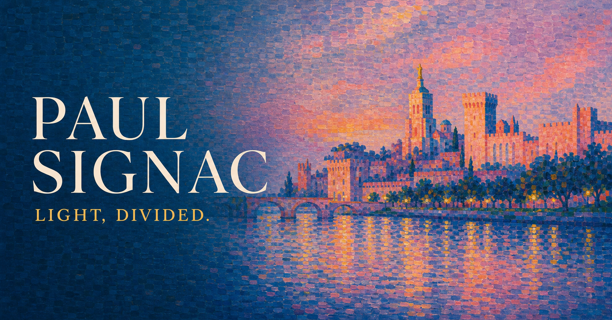

# Paul Signac — Light, Divided

一个以保罗·西涅克（Paul Signac）的色彩、光感与分色主义笔触为灵感的英文艺术家个人网站。首版以展览图录式的叙事呈现西涅克的生平、艺术历程和代表作品；页面结构与内容数据相互独立，也可作为其他艺术家或创作者的网站模板。

**在线预览：** [paul-signac-dusk-gallery.zhlei86.chatgpt.site](https://paul-signac-dusk-gallery.zhlei86.chatgpt.site)



## 项目内容

- 五个响应式页面：首页、关于我、艺术历程、作品和联系我。
- 集中、类型化的数据模型，管理艺术家资料、时间线、作品记录和联系方式。
- 支持筛选与详情弹层的作品画廊，可通过键盘操作，并支持 Escape 关闭与焦点管理。
- 以《阿维尼翁·夜晚（教皇宫）》(*Avignon. Soir (le chateau des Papes)*, 1909) 为视觉核心：河流蓝、暮色紫、珊瑚建筑与金橙色晚光。
- 以 CSS 渐变和克制的色彩碎片呼应分色主义，不干扰长文阅读。
- 适配移动端导航，并遵循 `prefers-reduced-motion` 减弱动画偏好。
- 包含五幅本地作品图、定制站点图标与社交分享图。

## 技术栈

- React 19 + TypeScript
- Vinext / Vite
- 原生 CSS（响应式布局与无障碍交互）
- pnpm

## 本地运行

请使用 Node.js 22.13 或更高版本，以及 pnpm。

```bash
pnpm install
pnpm dev
```

构建生产版本：

```bash
pnpm build
```

运行生产渲染检查：

```bash
pnpm test
```

## 目录结构

```text
app/
  about/             “关于我”页面
  contact/           “联系我”页面
  journey/           艺术历程时间线
  works/             作品画廊页面
  components/        公共页面框架和无障碍作品详情弹层
  data.ts            可复用的艺术家、时间线、作品与联系信息数据
  globals.css        视觉系统与响应式样式
public/
  artworks/          五幅精选作品图片
  og.png             社交分享图
tests/
  rendered-html.test.mjs
```

## 复用为个人网站模板

页面结构与内容数据已分离。若要替换为另一位艺术家或创作者：

1. 在 `app/data.ts` 替换人物、作品、时间线和联系信息。
2. 在 `public/artworks/` 替换图片，并同步更新图片路径和替代文本。
3. 在 `app/globals.css` 调整配色变量与字体。
4. 在 `app/layout.tsx` 和 `public/og.png` 更新站点元数据与社交分享图。

## 研究资料与图片说明

本项目配套的生平资料与来源注释维护在上级目录的 `Paul Signac Biography.md`。网站研究主要参考以下博物馆及艺术机构的艺术家档案、馆藏页面：奥赛博物馆、纽约大都会艺术博物馆、英国国家美术馆、纽约现代艺术博物馆、海牙市立博物馆、国立西洋美术馆与托莱多艺术博物馆。各作品的馆藏链接可在 `app/data.ts` 中查看。

项目内的作品图像由项目方提供。再次发布、再分发或替换这些图片前，请自行确认作品、博物馆图像及相关权利人的使用许可。

## 许可

当前仓库尚未附加开源许可证。复用代码或素材前，请先取得项目所有者许可。
